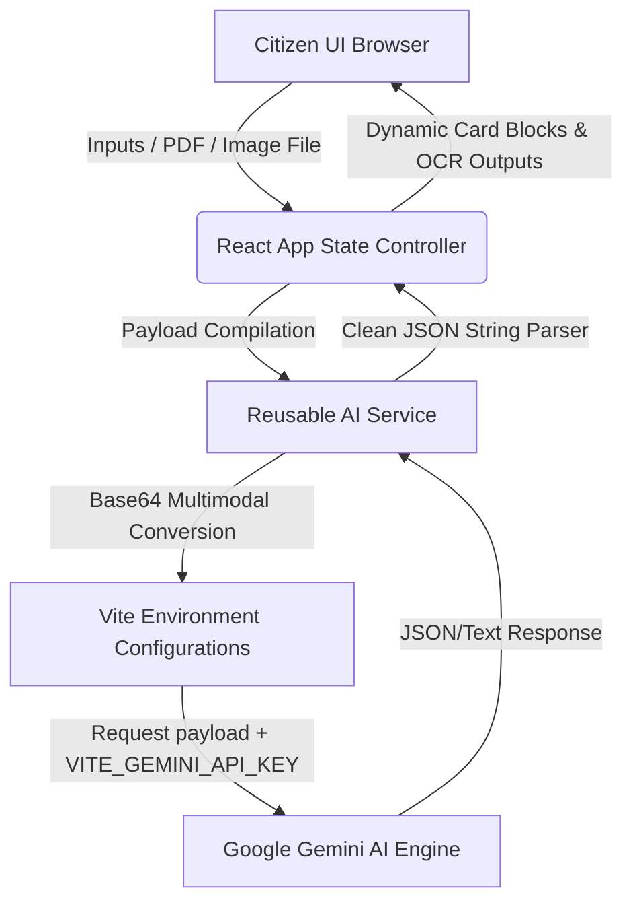

# Smart Bharat – AI Powered Civic Companion 🇮🇳

[](https://react.dev)
[](https://vitejs.dev)
[](https://tailwindcss.com)
[](https://deepmind.google/technologies/gemini/)
[](https://opensource.org/licenses/MIT)

An advanced AI-powered civic assistant and welfare portal engineered for Indian citizens. Smart Bharat simplifies access to government schemes, automates grievance drafting, explains complex legal notices, and helps citizens explore prompt engineering interactively.

---

## 📌 Table of Contents
- [Problem Statement](#-problem-statement)
- [Solution Overview](#-solution-overview)
- [Key Features](#-key-features)
- [Prompt Engineering Showcase](#-prompt-engineering-showcase)
- [Technology Stack](#-technology-stack)
- [System Architecture](#-system-architecture)
- [Project Workflow](#-project-workflow)
- [Installation Instructions](#-installation-instructions)
- [Environment Variables](#-environment-variables)
- [Screenshots](#-screenshots)
- [Future Enhancements](#-future-enhancements)
- [Team Information](#-team-information)
- [License](#-license)
- [Acknowledgements](#-acknowledgements)

---

## 🚨 Problem Statement
Navigating Indian civic infrastructure is often overwhelming for citizens:
- **Information Fragmentation**: Social welfare schemes are distributed across multiple state and central ministry sites.
- **Language Barriers**: Complex legal alerts and official notices use high-level terminology that is difficult to parse.
- **Access Clogs**: Drafting formal civic complaints is tedious, and citizens often struggle to structure letters correctly to reach government grievance portals.

---

## 💡 Solution Overview
**Smart Bharat** bridges this gap as an **AI-driven Civic Copilot** that translates bureaucratic clutter into clean citizen action.
By leveraging Google's **Gemini 2.5 Flash** model with advanced prompt engineering, it provides:
- Live eligibility calculations for central and state schemes.
- Auto-generation of formal grievance petitions with isolated print-to-PDF styles.
- Multimodal explanation (OCR) of images and PDF legal documents.
- An interactive prompt studio to teach citizens the value of query refining.

---

## 🌟 Key Features

### 💬 AI Civic Assistant
- Conversational assistant powered by Gemini.
- Renders formatting options (bullet points, bold text structures, headers).
- Features **dynamic follow-up suggestion chips** generated live based on chat context.

### 🔍 Government Scheme Finder
- Accepts applicant's Age, Gender, Category, State, and Annual Income parameters.
- Recommends eligible Central & State welfare programs with match-reasons, documents required, and links to apply online.

### 📝 AI Complaint Generator
- Crafts legal-grade complaint petitions addressed to Municipal, Electrical, Water, or Police departments.
- Outputs assigned department, priority rating, expected timelines, summary, and suggested attachments.
- Supports **instant copy**, **text download**, and browser-integrated **Print-to-PDF** layout stylesheets.

### 📂 Legal Document Explainer
- Supports uploading **PDF** and **Image** files.
- Extracts character sequences (OCR) and formats explanations for purpose, usage, validity, and associated documents.
- Highlights legal jargon keywords (e.g., *Mutation*, *Patwari*, *NOC*, *Encumbrance*) with hoverable glossary popovers.

### 🧠 AI Prompt Studio
- An educational playground containing three parallel cards (Original Prompt, Prompt Engineering breakdown, and Gemini Response).
- Teaches prompt engineering live.

---

## 🧪 Prompt Engineering Showcase
Smart Bharat uses five core prompt engineering techniques:

| Technique | Implementation inside Smart Bharat | Benefit |
| :--- | :--- | :--- |
| **Role Prompting** | Configures Gemini as specialised personas (e.g. *Chief Administrative Officer*, *Indian Grievance Officer*, *Welfare Advisor*). | Enforces an official, professional, and authoritative vocabulary. |
| **Context Injection** | Feeds live citizen profile states (age, income bracket, city) directly into prompts. | Guarantees recommendations align strictly with demographic criteria. |
| **Structured Output** | Demands replies formatted as strict JSON schemas without markdown decorators. | Enables the React frontend to parse text elements and render them as visual cards. |
| **Constraint Prompting** | Enforces word counts, tone filters, and mandates short, professional, and clear language. | Prevents model hallucinations, long summaries, or conversational clutter. |
| **Prompt Optimization** | Breaks queries down into segments (Role, Context, Constraints, Structure) inside the AI Prompt Studio. | Demonstrates the improvement in quality between basic inputs and optimized drafts. |

---

## 🛠️ Technology Stack
- **Frontend Framework**: [React 19](https://react.dev/) + [Vite](https://vite.dev/) (Client SPA)
- **Styling**: [Tailwind CSS](https://tailwindcss.com/) (Modern layouts, glassmorphism dashboard structures)
- **Icons**: [Lucide React](https://lucide.dev/) (Sleek stroke icons)
- **Routing**: [React Router DOM](https://reactrouter.com/) (Nodal sidebar routing tree)
- **AI Engine**: [Google Gemini 2.5 Flash SDK](https://www.npmjs.com/package/@google/generative-ai) (Multimodal content generation & OCR)

---

## 📐 System Architecture


---

## 🔄 Project Workflow
```
[Citizen Input]
       ↓
[Prompt Engineering (Role + Context + Constraints + Structure)]
       ↓
[Gemini AI (Multimodal Input Analysis)]
       ↓
[Clean AI Response (Structured JSON Parsing)]
       ↓
[User Interface Cards (Copy / Print / Download)]
```

---

## 🚀 Installation Instructions

### Prerequisites
- Node.js (v18.0.0 or higher)
- npm (v9.0.0 or higher)

### Setup Steps
1. **Clone the Repository**
   ```bash
   git clone https://github.com/your-username/smart-bharat-companion.git
   cd smart-bharat-companion
   ```

2. **Install Package Dependencies**
   ```bash
   npm install
   ```

3. **Configure Environment Variables**
   Create a `.env` file in the root directory:
   ```bash
   touch .env
   ```
   Add your API Key:
   ```env
   VITE_GEMINI_API_KEY=your_google_gemini_api_key_here
   ```

4. **Launch Local Development Server**
   ```bash
   npm run dev
   ```
   Open your browser to: [http://localhost:5173](http://localhost:5173)

5. **Build for Production**
   ```bash
   npm run build
   ```

---

## 🔑 Environment Variables
| Variable Name | Required | Description |
| :--- | :---: | :--- |
| `VITE_GEMINI_API_KEY` | **Yes** | Your private Google AI Studio key used to authenticate request headers to Gemini 2.5 Flash. Keep it secure and do not commit this to public version control registries. |

---

## 📸 Screenshots

| Dashboard Overview | AI Grievance Generator |
| :---: | :---: |
|  |  |

| Document Explainer | AI Prompt Studio |
| :---: | :---: |
|  |  |

---

## 🔮 Future Enhancements
- **Multi-lingual Voice Input**: Integration of text-to-speech for regional Indian languages (Hindi, Tamil, Bengali, Telugu, etc.).
- **Official Grievance Submission API**: Direct API hooks to central state PG portals (CPGRAMS) to submit generated drafts immediately.
- **Offline Scheme Lookup**: PWA offline caching of schemes to support rural regions with low internet connectivity.

---

## 👥 Team Information
- **Team Name**: *[Insert Hackathon Team Name]*
- **Members**:
  - Member 1: *[Name - Developer/Design]* - GitHub: [@username](https://github.com/)
  - Member 2: *[Name - Pitch/Research]* - GitHub: [@username](https://github/)

---

## 📄 License
This project is licensed under the MIT License - see the [LICENSE](LICENSE) file for details.

---

## 🤝 Acknowledgements
- **Digital India Initiative**: For inspiriting civic accessibility.
- **Google DeepMind**: For providing the Google Gemini API.
- **Hackathon Organisers**: For providing the platform to build Smart Bharat.
